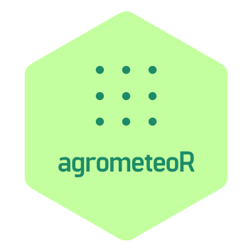

```{r, echo = FALSE}
knitr::opts_chunk$set(
  collapse = TRUE,
  comment = "#>",
  fig.path = "man/figures/"
)
```

# AgrometeoR 

## Introduction 

This R Package is dedicated to "Automatic Weather Station" (AWS) Network data spatialization. It is currently being developed by the [CRA-W](http://www.cra.wallonie.be) in the context of the [Agromet Project](./vignettes/presentation-agromet-project.Rmd).

In short, the aim of the Agromet project is to provide a near real-time hourly gridded datasets of weather parameters (Air temperature, rainfall, relative humidity and leaves wetness) at the resolution of 1 km² for the whole region of Wallonia

This package constitutes the core of the spatialization process of weather data. It makes an heavy use of [mlr](https://mlr.mlr-org.com/index.html) package and its unified interface for Machine Learning (ML) algorithms benchmarking.

Many vignettes documenting our development process are availbale. Check them to understand our development strategy !

## Installation

### Prerequisites

You can install this package using [devtools](https://www.rstudio.com/products/rpackages/devtools/) package. We highly recommand you to use [packrat](https://rstudio.github.io/packrat/) package for you projects relying on this package. Doing so will ensure you have a sandbox environment with all the required versions of packages needed to make it work. 

As this package requires geographic/spatial capabilities, you will also need multiple system dependencies. This package was developped under a containerized Debian environment based on the [rocker/tidyverse](https://hub.docker.com/r/rocker/tidyverse/) docker image. This dockerized environment is available on docker hub under the name [pokyah/agrometeordocker](https://hub.docker.com/r/pokyah/agrometeordocker/). As stated in the docker file of our developement container, multiple Linux Debian OS dependencies are required to make our package work (full list specified in the installation instruction paragraph).

You will also of course need R to make the package works !  

### Instructions

#### Install The Debian dependencies required.

To do this, in debian, simply open a terminal, paste and execute the following line : 

```bash
# installation of OS dependencies
sudo apt-get update \
    && sudo apt-get install -y software-properties-common \
    && sudo apt-get update -q \
    && sudo apt-get install -y \
      texlive-full \
      jq \
      libjq-dev \
      libv8-3.14-dev \
      libprotobuf-dev \
      protobuf-compiler \
      libjq-dev \
      openssh-server \
      libxml2-dev \
      libssl-dev \
      libcurl4-openssl-dev \
      libgeos-dev \
      libcairo2-dev \
      libudunits2-dev \
      gdal-bin \
      libgdal-dev \
      libproj-dev \
      freeglut3 \
      freeglut3-dev \
      mesa-common-dev \
      default-jdk \
      r-cran-rjava \
    && sudo apt-get clean \ 
    && sudo rm -rf /var/lib/apt/lists/ \ 
    && sudo rm -rf /tmp/downloaded_packages/ /tmp/*.rds \
```
#### Install R

if not yet installed on your machine, simply use : 

```bash
sudo apt install dirmngr
sudo apt-key adv --keyserver keys.gnupg.net --recv-key 'E19F5F87128899B192B1A2C2AD5F960A256A04AF'
sudo apt update
sudo apt install r-base
```

#### Install the two system wide required packages

`devtools` (to install packages from github) and `packrat` (to install all the other packages in a sandbox environment). To do so, open your R console and type the following : 

```r
install.packages("devtools")
install.packages("packrat")
```

#### Create a folder for your project.

In your console :  

```bash
mkdir <YOUR_PROJECT>
```

#### Enable packrat for this folder.

Open your R console in this folder and initialize packrat :

```r
packrat::init()
```

You are now in packrat mode for this folder. All the package you will install from this folder will be installed in the folder private library (see [packrat doc](https://rstudio.github.io/packrat/) for more information).

#### Install the agrometeoR package.

In your R console : 

```r
devtools::install_github("pokyah/agrometeoR", ref = "master")
```

This command will also automatically install all the required R packages needed to make this package work (these are specified in the [DESCRIPTION](./DESCRIPTION) file of the package) into your project packrat private library.

#### Add your AGROMET API key.

This API key is required to get data from the PAMESEB database. At the root of your project folder, create a `.Renviron` file and paste the following line : 

`AGROMET_API_V1_KEY = <YOUR_TOKEN>`

You are now ready to go ! 

## Packages datasets 

Multiple objects come precompiled with the package : 

* `agrometeorLearners`
* `grid.df` & `grid.sf` & `grid.squares.sf`
* `stations.df` $ `stations.sf` 


## Logo

Logo created with [logojoy](https://logojoy.com/editor/23591201)


